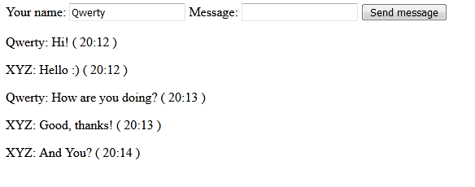

# ChatWebSocket
Online chat in Spring Boot 
## Technology stack: Spring Boot, Web, WebSocket, STOMP
Users can visit the website, enter their username, write messages and send it. Then the message is processed by the server and send to every subscriber.

